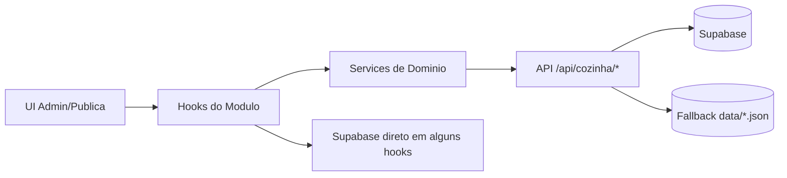
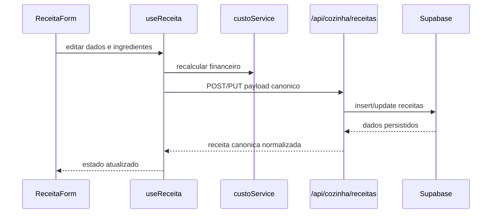
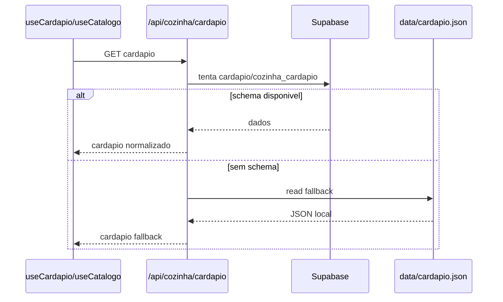
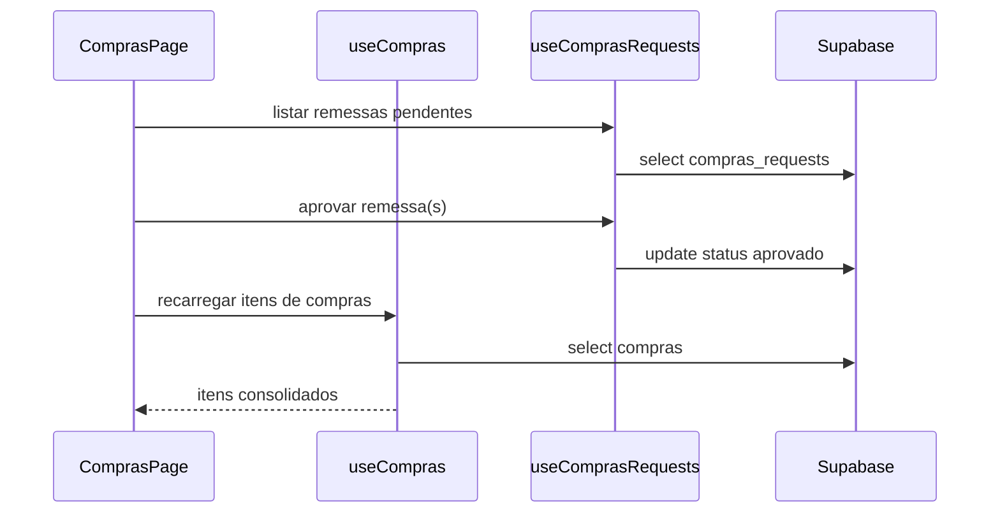

# APOSTILA TECNICA DE ESTUDO
# MODULO COZINHA CHEF NEIDE

Versao: 1.0  
Projeto: Valente Conecta  
Atualizado em: 2026-07-22

---

## COMO USAR ESTA APOSTILA

Este material foi organizado em modulos de estudo para facilitar onboarding tecnico, manutencao e evolucao segura do modulo Cozinha.

Objetivos da apostila:

- consolidar o estado tecnico real do modulo;
- documentar arquitetura, fluxos e contratos;
- listar pontos de risco e pendencias tecnicas;
- orientar evolucao sem quebrar o fluxo central.

Fluxo de negocio central que deve ser preservado:

RECEITA -> CARDAPIO/CATALOGO -> PEDIDO -> PRODUCAO -> ESTOQUE -> COMPRAS -> FINANCEIRO

---

## MODULO 1: VISAO GERAL DO MODULO COZINHA

### 1.1 Escopo funcional

O modulo Cozinha atende dois contextos:

- operacao interna (admin-master/cozinha-chef);
- vitrine publica (cozinha/catalogo e cozinha/cardapio).

Capacidades principais:

- cadastro e edicao de receitas;
- formacao de custo e preco da receita;
- publicacao em cardapio;
- consulta de estoque;
- movimentacao manual de estoque;
- lista de compras e aprovacao de remessas;
- visao financeira basica;
- consulta de producao e pedidos.

### 1.2 Rotas de interface ativas (admin)

- /admin-master/cozinha-chef
- /admin-master/cozinha-chef/receitas
- /admin-master/cozinha-chef/receitas/novo
- /admin-master/cozinha-chef/receitas/editar/[id]
- /admin-master/cozinha-chef/estoque
- /admin-master/cozinha-chef/estoque/movimentacao
- /admin-master/cozinha-chef/movimentacoes
- /admin-master/cozinha-chef/compras
- /admin-master/cozinha-chef/producao
- /admin-master/cozinha-chef/pedidos
- /admin-master/cozinha-chef/financeiro

### 1.3 Rotas publicas de cozinha

- /cozinha (redireciona para catalogo)
- /cozinha/catalogo
- /cozinha/cardapio

### 1.4 Entidade central

A entidade central e RECEITA.

A receita alimenta:

- custo e preco;
- composicao de ingredientes;
- publicacao em cardapio/catalogo;
- consumo de estoque;
- previsao de compras;
- impacto financeiro.

---

## MODULO 2: ARQUITETURA TECNICA ATUAL

### 2.1 Stack do modulo

- Next.js App Router
- React + TypeScript
- TailwindCSS
- Supabase (persistencia principal)
- fallback local em JSON para partes especificas

### 2.2 Estrutura de pastas relevantes

- app/admin-master/cozinha-chef (telas admin)
- app/admin-master/cozinha-chef/hooks (hooks do modulo)
- app/admin-master/cozinha-chef/services (services do modulo)
- app/api/cozinha (API Routes do modulo)
- types/cozinha.ts e types/receita-canonica.ts (contratos)
- data/*.json (fallback/legado e dados locais)

### 2.3 Camadas observadas no codigo

```text
UI (pages/components)
  -> hooks (estado e orquestracao)
    -> services (normalizacao e regras pontuais)
      -> API Routes (parte do modulo)
        -> Supabase
```

### 2.4 Mapa arquitetural simplificado



Observacao tecnica:

- O modulo esta em estado hibrido. Parte passa por API e parte acessa Supabase diretamente via hooks.

---

## MODULO 3: FRONTEND ADMIN - TELAS E RESPONSABILIDADES

### 3.1 Dashboard

Arquivos base:

- app/admin-master/cozinha-chef/page.tsx
- app/admin-master/cozinha-chef/containers/DashboardContainer.tsx
- app/admin-master/cozinha-chef/components/DashboardUI.tsx

Estado atual:

- dashboard usa dados mockados no container;
- serve como integracao de navegacao para submodulos.

### 3.2 Receitas

Arquivos base:

- app/admin-master/cozinha-chef/receitas/page.tsx
- app/admin-master/cozinha-chef/receitas/novo/page.tsx
- app/admin-master/cozinha-chef/receitas/editar/[id]/page.tsx
- app/admin-master/cozinha-chef/receitas/_components/ReceitaFormularioCanonico.tsx
- app/admin-master/cozinha-chef/hooks/useReceita.ts
- app/admin-master/cozinha-chef/services/custoService.ts

Pontos tecnicos:

- uso de contrato canonico com compatibilidade legada;
- calculo financeiro da receita no service de custo;
- fallback de leitura/salvamento para endpoints alternativos quando necessario.

### 3.3 Compras

Arquivos base:

- app/admin-master/cozinha-chef/compras/page.tsx
- app/admin-master/cozinha-chef/hooks/useCompras.ts
- app/admin-master/cozinha-chef/hooks/useComprasRequests.ts

Capacidades:

- aprovacao individual, em lote e total de remessas pendentes;
- exclusao seletiva de ingredientes da soma na aprovacao;
- impressao de extrato de compras.

### 3.4 Estoque e movimentacoes

Arquivos base:

- app/admin-master/cozinha-chef/estoque/page.tsx
- app/admin-master/cozinha-chef/estoque/movimentacao/page.tsx
- app/admin-master/cozinha-chef/movimentacoes/page.tsx
- app/admin-master/cozinha-chef/hooks/useEstoque.ts

Capacidades:

- listagem e filtro de estoque;
- registro de entradas/saidas manuais;
- fallback localStorage para historico de movimentacoes.

### 3.5 Producao, pedidos e financeiro

Arquivos base:

- app/admin-master/cozinha-chef/producao/page.tsx + hook useProducao
- app/admin-master/cozinha-chef/pedidos/page.tsx + hook useDashboard
- app/admin-master/cozinha-chef/financeiro/page.tsx + hooks useFinanceiro/useFinanceiroPessoal

Estado atual:

- producao consome Supabase direto via hook (tabela `producao`), tela hoje so' le (create/update/delete do hook nao estao ligados a nenhum botao) — nao serve ainda como ferramenta real de planejamento;
- pedidos depende de ultimos pedidos no hook de dashboard, que tambem faz select direto em tabelas genericas (`vendas`, `compras`, `pedidos`, `alertas`, `movimentacoes`) nao confirmadas nas migrations do projeto — tela e' so' leitura, sem acao de status;
- causa raiz de "pedidos" estar vazio/sem uso: o catalogo publico (app/cozinha/catalogo/page.tsx) tem um botao "Adicionar" em cada item SEM nenhum onClick — hoje nao existe nenhum fluxo de checkout que gere pedido de verdade;
- financeiro possui tela em modo simplificado e hook dedicado para API financeira.

REMOVIDO (2026-08-30): pagina/hook "Pratos & Produtos" (app/admin-master/cozinha-chef/pratos + hooks/usePratos.ts + types/pratos.ts). Motivo: consumia uma tabela `pratos` propria e desconectada, violando a regra de nao-duplicacao (00_FILOSOFIA_DO_MODULO.md secao 7) — a propria tela so' tinha um botao "Ir para Receitas", sem nenhuma acao de criar/editar/destacar ligada, apesar do hook ter CRUD completo. O conceito documentado em 01_ARQUITETURA_FUNCIONAL.md secao 5 ("visualizacao comercial das receitas: organizar apresentacao, categorias, disponibilidade, destaque") continua valido para uma reconstrucao futura — so' precisa nascer de `receitas` publicadas, nunca de cadastro proprio.

---

## MODULO 4: FRONTEND PUBLICO - CATALOGO E CARDAPIO

### 4.1 Catalogo publico

Arquivos base:

- app/cozinha/catalogo/page.tsx
- app/admin-master/cozinha-chef/hooks/useCatalogo.ts

Comportamento:

- carrega receitas e cardapio;
- aplica desconto por perfil (publico, assinante, revendedor);
- separa pratos e sobremesas por categoria.

### 4.2 Cardapio publico

Arquivos base:

- app/cozinha/cardapio/page.tsx
- hooks/useCardapio.ts

Comportamento:

- consome /api/cozinha/cardapio e /api/cozinha/recipes;
- normaliza aliases de campos entre schemas diferentes.

---

## MODULO 5: HOOKS - ORQUESTRACAO DE ESTADO

### 5.1 Hooks principais do modulo

- useReceita
- useCompras
- useComprasRequests
- useEstoque
- useProducao
- usePratos
- useDashboard
- useFinanceiro
- useFinanceiroPessoal
- useCatalogo
- useHybridData
- useIngredients
- usePerfilCozinha

### 5.2 Padroes observados

- padrao de loading/error consistente em grande parte dos hooks;
- coexistencia de fetch para API e acesso direto ao Supabase;
- uso de fallback para endpoints legados em receitas.

### 5.3 Risco arquitetural atual

- alguns hooks de admin misturam logica de dominio com adaptacoes de transporte;
- parte das pages ainda usa fetch direto, sem centralizacao completa no service.

---

## MODULO 6: SERVICES - REGRAS E ADAPTADORES

### 6.1 Services do modulo

- comprasService
- estoqueService
- pratosService
- producaoService
- dashboardService
- custoService

### 6.2 Destaque: custoService

Responsabilidades centrais:

- normalizar ingredientes canonicos;
- calcular custo da receita;
- calcular custo por unidade;
- calcular margem e lucro;
- montar payload canonico para persistencia.

### 6.3 Observacao de maturidade

- custoService concentra as regras mais robustas do modulo;
- os demais services estao mais orientados a CRUD e podem evoluir para camada de dominio mais forte.

---

## MODULO 7: APIS DO MODULO COZINHA

### 7.1 Endpoints ativos confirmados

- /api/cozinha/cardapio
- /api/cozinha/estoque
- /api/cozinha/estoque/[id]
- /api/cozinha/financeiro
- /api/cozinha/financeiro/[id]
- /api/cozinha/receitas
- /api/cozinha/receitas/[id]
- /api/cozinha/recipes

### 7.2 Caracteristicas da API de receitas

- contrato canonico com adaptador em canonical.ts;
- suporte a aliases para manter compatibilidade legada;
- fallback de consulta/listagem via /recipes.

### 7.3 Caracteristicas da API de cardapio

Resolucao de schema:

1. tabela cardapio
2. tabela cozinha_cardapio
3. fallback em data/cardapio.json

Isso garante disponibilidade mesmo quando tabelas especificas nao existem no banco.

### 7.4 Endpoints esperados pelo frontend, mas nao ativos nesta arvore

Conforme mapeamento de codigo e relatorios internos, existem referencias historicas a:

- /api/cozinha/pedidos
- /api/cozinha/compras
- /api/cozinha/compras-requests
- /api/cozinha/producao
- /api/cozinha/stock-movements
- /api/cozinha/ingredients

No estado atual desta arvore, esses endpoints nao possuem route.ts ativo em app/api/cozinha.

---

## MODULO 8: DADOS, CONTRATOS E COMPATIBILIDADE

### 8.1 Contratos principais

- types/cozinha.ts
- types/receita-canonica.ts
- app/admin-master/cozinha-chef/types/*

### 8.2 Estrategia de compatibilidade

O modulo adota normalizacao de nomes para coexistir com formatos:

- canonico (receita canonica);
- legado (nome/descricao/preco/custo_total/ativo);
- variacoes em portugues e ingles (ingredientes/ingredients, receita_id/recipe_id).

### 8.3 Fontes de dados fallback identificadas

- data/cardapio.json
- data/compras.json
- data/compras_requests.json
- data/estoque.json
- data/ingredientes.json
- data/pedidos.json
- data/receitas.json

Observacao:

- nem todo arquivo de data e usado por endpoint ativo atualmente;
- parte representa heranca de versoes anteriores e contingencia local.

---

## MODULO 9: FLUXOS TECNICOS CHAVE

### 9.1 Fluxo de receita (CRUD + custo)



### 9.2 Fluxo de publicacao em cardapio



### 9.3 Fluxo de compras pendentes



---

## MODULO 10: SEGURANCA, QUALIDADE E OPERACAO

### 10.1 Praticas observadas

- tratamento basico de erro nas APIs;
- respostas padrao success/data/error em varios endpoints;
- normalizacao defensiva de tipos (Number, String, boolean).

### 10.2 Lacunas tecnicas atuais

- encoding inconsistente em alguns arquivos (texto com caracteres corrompidos);
- divergencia entre arquitetura alvo (service-first) e implementacao hibrida;
- endpoints esperados por telas legadas sem route.ts ativa;
- dashboard admin principal ainda com dados mockados.

### 10.3 Riscos operacionais

- regressao ao remover fallback sem migracao completa;
- divergencia de schema entre tabelas legadas e canonicas;
- acoplamento de parte das telas a formatos legados de dados.

---

## MODULO 11: MATRIZ DE EVOLUCAO RECOMENDADA

### 11.1 Fase 1 - Consolidacao de contratos

- consolidar DTOs de entrada/saida por endpoint;
- padronizar sucesso/erro HTTP e payload JSON;
- remover aliases redundantes apos migracao validada.

### 11.2 Fase 2 - Fechamento de lacunas de API

- reativar ou retirar oficialmente endpoints legados referenciados;
- alinhar hooks para consumir somente endpoints ativos;
- eliminar dependencia de localStorage em fluxo critico de estoque.

### 11.3 Fase 3 - Fortalecimento de dominio

- mover regras dispersas para services especializados;
- manter componentes sem regra de negocio;
- manter receita como fonte unica de custo e composicao.

### 11.4 Fase 4 - Observabilidade

- instrumentar logs estruturados por endpoint;
- criar indicadores de erro por rota critica;
- documentar runbook de incidentes do modulo cozinha.

---

## MODULO 12: CHECKLIST TECNICO PARA ALTERACOES FUTURAS

Antes de qualquer alteracao no modulo cozinha:

1. Identificar a funcionalidade e a rota afetada.
2. Confirmar o hook responsavel.
3. Confirmar o service/regra de dominio envolvido.
4. Confirmar o endpoint e o contrato de payload.
5. Confirmar tabela/fallback que persiste os dados.
6. Validar impacto no fluxo RECEITA -> CARDAPIO -> PEDIDO -> PRODUCAO -> ESTOQUE -> COMPRAS -> FINANCEIRO.
7. Garantir compatibilidade com dados legados enquanto houver fallback ativo.

---

## APENDICE A: ARQUIVOS-CHAVE PARA ESTUDO RAPIDO

### A.1 Admin e dominio

- app/admin-master/cozinha-chef/hooks/useReceita.ts
- app/admin-master/cozinha-chef/services/custoService.ts
- app/admin-master/cozinha-chef/compras/page.tsx
- app/admin-master/cozinha-chef/hooks/useCompras.ts
- app/admin-master/cozinha-chef/hooks/useComprasRequests.ts
- app/admin-master/cozinha-chef/hooks/useEstoque.ts
- app/admin-master/cozinha-chef/movimentacoes/page.tsx

### A.2 APIs

- app/api/cozinha/receitas/route.ts
- app/api/cozinha/receitas/[id]/route.ts
- app/api/cozinha/receitas/canonical.ts
- app/api/cozinha/cardapio/route.ts
- app/api/cozinha/estoque/route.ts
- app/api/cozinha/financeiro/route.ts

### A.3 Publico

- app/cozinha/catalogo/page.tsx
- app/cozinha/cardapio/page.tsx
- hooks/useCardapio.ts

---

## CONCLUSAO

O modulo Cozinha ja possui base funcional relevante e arquitetura com direcao clara para modelo canonico de receitas. O principal trabalho de engenharia agora e consolidar contratos, fechar lacunas de endpoint, reduzir hibridismo e finalizar migracao para uma arquitetura de dominio consistente, sem perder compatibilidade com o legado durante a transicao.
